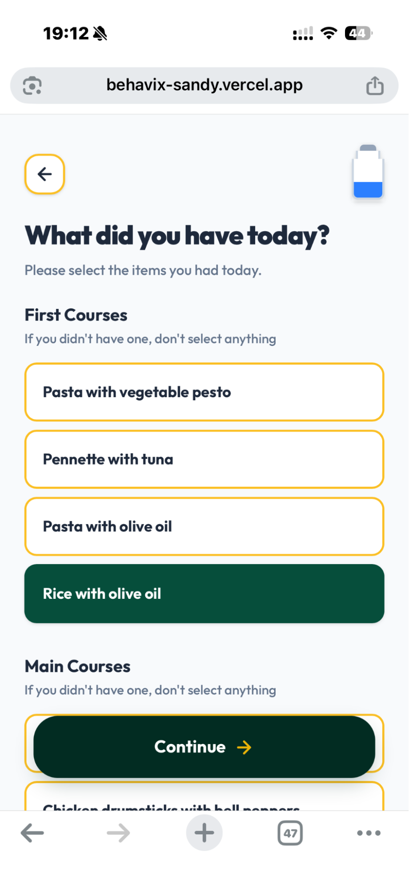
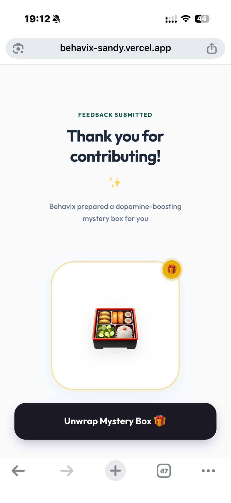
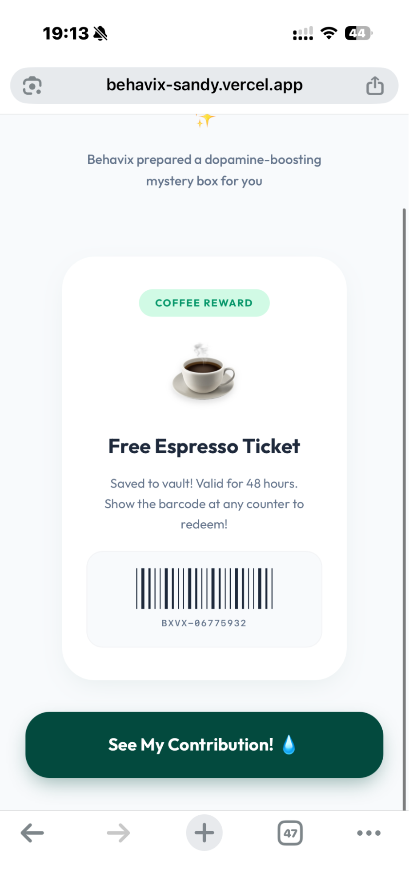
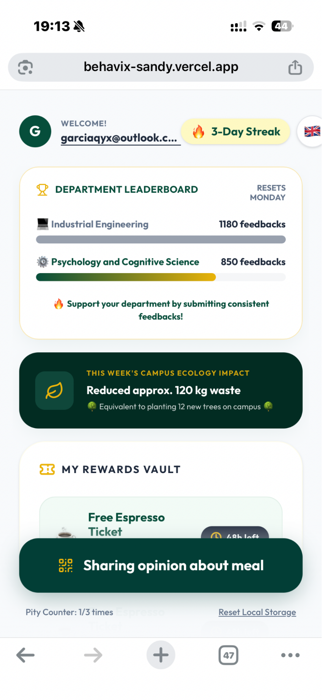
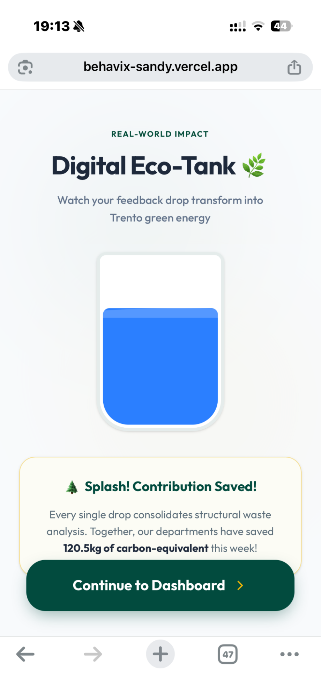
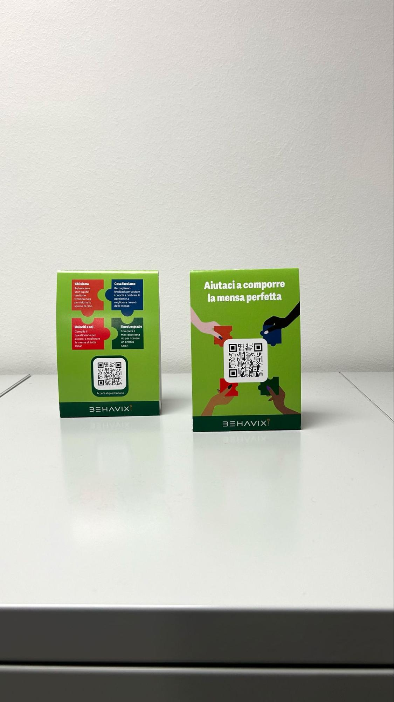

# Behavix

> **UX Redesign prototype** — Cooperative gamification for reducing food waste in university cafeterias.

<p align="center">
  
</p>

Behavix is a **one-week UX Challenge prototype** built by Team 1 at the University of Trento. The challenge was to take an existing, struggling food-waste feedback system and redesign its UX from scratch — turning a tool with a 90% dropout rate and 1% engagement into a cooperative, rewarding gamification experience targeting 20% engagement.

The codebase contains two fully functional apps sharing a single repo: a **diner-facing questionnaire** with streaks, mystery rewards, and department leaderboards, and a **canteen manager dashboard** with KPIs, AI-style advice, and dish-level waste forecasting.

> ⚠️ This is a **prototype** built for a design challenge. It is not a production-ready system.

---

## The Challenge

Behavix is a data-driven SaaS platform that uses AI to map food consumption behaviours in cafeterias. Its original feedback system had historically achieved 25,000+ feedbacks and 60% food waste reduction — but suffered a dramatic decline:

| Metric | Target | Pre-Redesign |
|--------|--------|-------------|
| Engagement rate (peak) | 20% | 1% |
| Dropout rate | — | 90% |

The UX challenge: redesign the feedback experience as a **cooperative and rewarding gamification loop** to restore engagement during crowded cafeteria peak hours, where cognitive load is highest.

---

## Team

> **Team 1** — UX Challenge, University of Trento, May–June 2026

| Name | Role |
|------|------|
| **Flavio Nardi** | Team Leader |
| **Giulia Famengo** | Head of Research |
| **Carlotta Zanetti** | Art Director |
| **Yuxin Qian** | UI Programmer |
| **Ana Akhalauri** | UX Designer |
| **Giuliano Campagnolo** | Lead Programmer |

---

## Screenshots

### Diner flow

<p align="center">
  
  &nbsp;&nbsp;
  
  &nbsp;&nbsp;
  
</p>

<p align="center">
  
  &nbsp;&nbsp;
  
</p>

### Physical touchpoint — Table tents

<p align="center">
  
</p>

---

## Design decisions

The solution combines a redesigned questionnaire flow with three gamification mechanics:

- **Post-Registration pattern** — users skip login and enter the feedback flow immediately after scanning the QR code, reducing the initial friction barrier.
- **Mystery Gift Box (variable reward scheme)** — replaces the old fixed coffee token with a lootbox lottery loop. Operating under a Variable Ratio Schedule, the uncertainty sustains long-term retention.
- **Department Leaderboard** — aggregates submissions into inter-faculty competition metrics, exploiting Social Comparison and Social Identity theories as a dual-layer motivational engine.
- **Digital Eco-Tank** — individual submissions increment a shared "green energy" tank, leveraging Epic Meaning (Octalysis Framework) to make isolated reporting feel like a collective contribution.
- **Pity counter** — guarantees a rare reward drop after N sessions without one, ensuring fairness in the lootbox system.

---

## Tech stack

- **Frontend**: React 19 + TypeScript + Vite 6
- **Styling**: TailwindCSS v4 (`@tailwindcss/vite`)
- **Animations**: Motion (Framer Motion successor) + `canvas-confetti`
- **Icons**: `lucide-react`
- **Backend (BaaS)**: Firebase Auth (Google + Apple) + Cloud Firestore
- **Entry points**: two separate HTML pages — `index.html` (diner) and `manager.html` (canteen manager)

---

## Prerequisites

- Node.js ≥ 18
- A [Firebase](https://firebase.google.com/) project with Authentication and Firestore enabled

## Setup

1. **Install dependencies:**
   ```bash
   npm install
   ```

2. **Configure environment variables:**
   Copy `.env.example` to `.env.local` and fill in your values:
   ```bash
   cp .env.example .env.local
   ```
   Edit `.env.local` with your Firebase project credentials (find them in the Firebase console under Project Settings → General → Your apps).

3. **Run locally:**
   ```bash
   npm run dev
   ```
   - Diner app: <http://localhost:3000/>
   - Manager dashboard: <http://localhost:3000/manager.html>

## Available scripts

| Script            | What it does                               |
|-------------------|--------------------------------------------|
| `npm run dev`     | Start the Vite dev server on port 3000     |
| `npm run build`   | Build for production into `dist/`          |
| `npm run preview` | Serve the production build locally         |
| `npm run lint`    | Type-check the project with `tsc --noEmit` |
| `npm run clean`   | Remove the `dist/` build folder            |

## Firebase Security Rules

Make sure your Firestore Security Rules restrict read/write access appropriately before deploying. At minimum:

```
rules_version = '2';
service cloud.firestore {
  match /databases/{database}/documents {

    // Users can read/write only their own profile
    match /users/{userId} {
      allow read, write: if request.auth != null
                         && request.auth.token.email != null
                         && userId == request.auth.token.email.replace('.', '_').lower();
    }

    // Anyone authenticated can submit feedback; reads from client are blocked
    match /feedback/{docId} {
      allow create: if request.auth != null;
      allow read:   if false;
    }
  }
}
```

## Project structure

```
behavix/
├─ index.html               # Diner entry point
├─ manager.html             # Manager dashboard entry point
├─ public/                  # Static assets (logo, screenshots)
├─ .github/workflows/       # CI (type-check + build on push/PR)
└─ src/
   ├─ main.tsx              # Diner React root
   ├─ manager.tsx           # Manager React root
   ├─ App.tsx               # Diner flow state machine
   ├─ types.ts              # Shared TypeScript types
   ├─ index.css             # Tailwind entry stylesheet
   ├─ views/                # Diner screens (10 ViewXxx components)
   ├─ manager/              # Manager feature (dashboard + sub-views + UI cards)
   ├─ components/           # Shared, reusable components
   ├─ data/                 # Mock datasets (dinerMock, managerMock)
   └─ lib/                  # Cross-cutting helpers (firebase.ts, utils.ts)
```

## Live prototypes

- Diner app: <https://behavix-sandy.vercel.app/>
- Manager dashboard: <https://behavix-dashboard.vercel.app/manager.html>

## License

[MIT](LICENSE)
